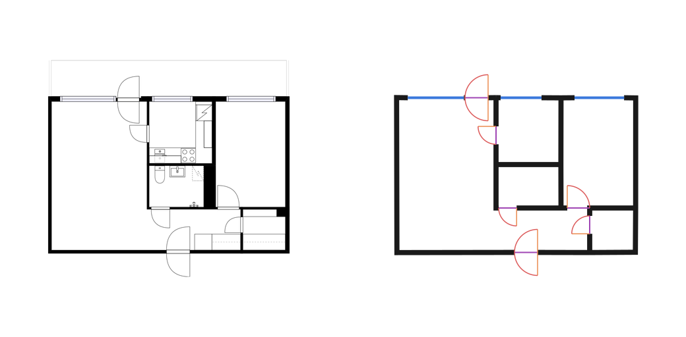
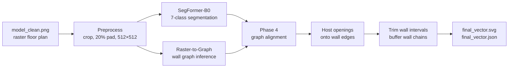
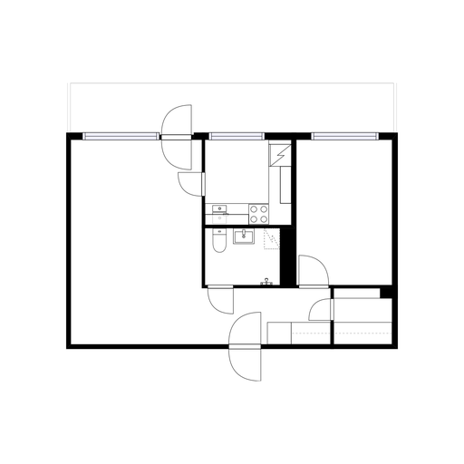
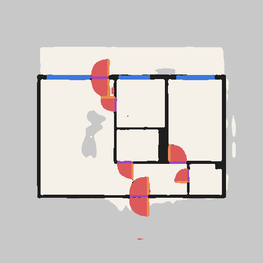
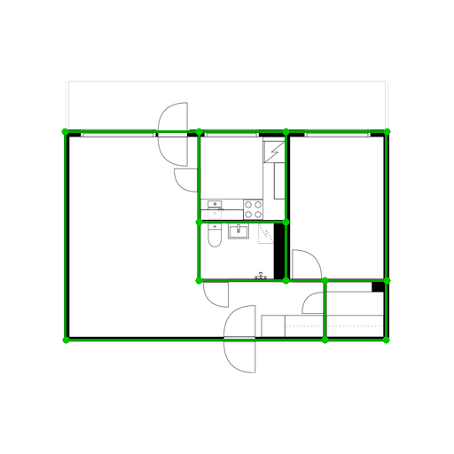
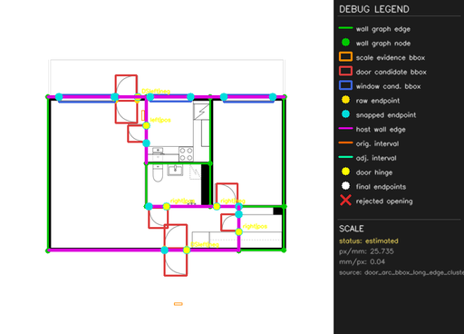
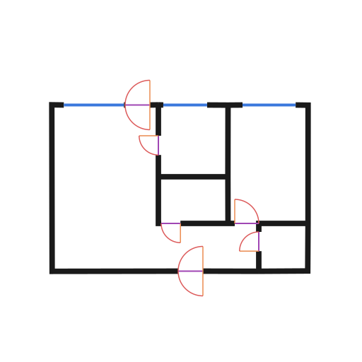
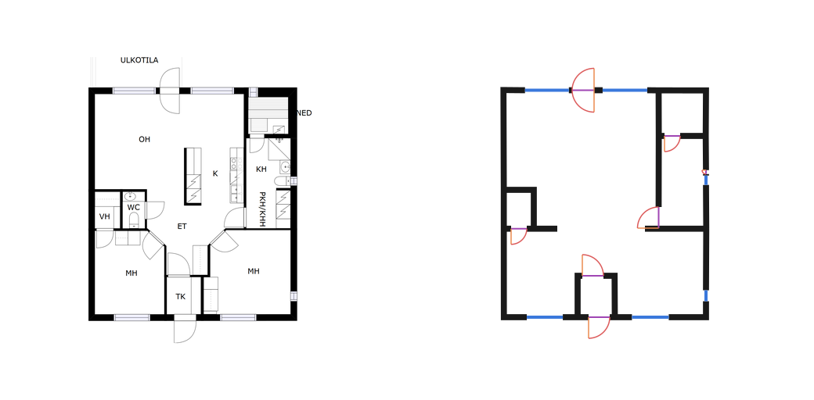
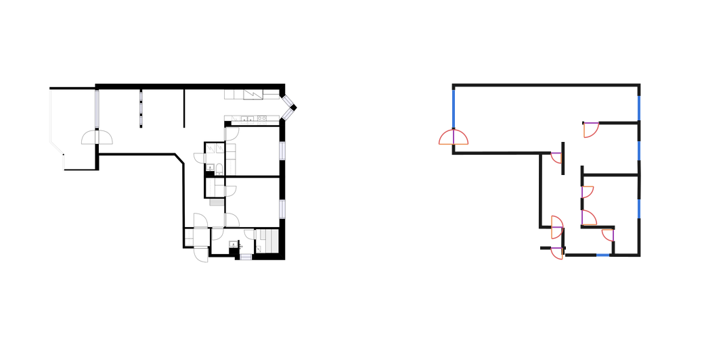

# Neural Floorplan — Raster Floor Plans to Classified CAD Geometry

[](https://github.com/daegeun-kim/neural_floorplan/actions/workflows/ci.yml)
[](LICENSE)
[](pyproject.toml)

Combines semantic segmentation with graph-based wall extraction to turn raster
floor plans into classified, CAD-like vector geometry — prioritising circulation,
openings, and wall topology over pixel-perfect tracing.



*Left: input raster (`model_clean.png`). Right: generated `final_vector.svg`.
Sample `11931`, the highest-scoring case in the evaluation run, selected by a
fixed rule rather than by eye. Furniture and fixtures are intentionally dropped —
the target is architectural geometry, not a redrawing of the source image.*

---

## Contents

- [What this does](#what-this-does)
- [Results](#results)
- [How it works](#how-it-works)
- [Honest limitations](#honest-limitations)
- [Setup](#setup)
- [Running the pipeline](#running-the-pipeline)
- [Evaluation](#evaluation)
- [Model release](#model-release)
- [Repository layout](#repository-layout)
- [License and attribution](#license-and-attribution)
- [Citations](#citations)

---

## What this does

A floor plan raster carries no structure: it is pixels. Architectural software
needs *objects* — walls that meet at junctions, doors hosted in those walls,
rooms you can actually walk between. This project recovers that structure.



The two branches do different jobs. Segmentation answers *what is here* — this
is a window, that is a door swing. Raster-to-Graph answers *how walls connect* —
endpoints, edges, junctions. Neither alone produces usable CAD geometry; Phase 4
fuses them.

SegFormer is deliberately a supporting component, not the destination of the
project. Its pretrained encoder is frozen and only a seven-class decoder is
trained. The acceptance criterion is downstream utility: locate enough door and
window evidence for Phase 4 to host openings onto the wall graph. Maximising a
standalone segmentation score or reproducing every boundary pixel is outside
that role; once the seven-class output was usable for fusion, development moved
to topology, hosting, and circulation.

**Seven classes:** `background`, `floor`, `wall`, `window`, `door_arc`,
`door_leaf`, `door_origin`.

### Pipeline stages

| Stage | Output |
|---|---|
|  | **1. Input.** Cropped to content, 20% white padding, scaled to a 512×512 canvas. |
|  | **2. Segmentation.** SegFormer-B0 seven-class prediction. This is *evidence*, not the output. |
|  | **3. Wall graph.** Raster-to-Graph junctions and edges, aligned to orthogonal axes. |
|  | **4. Opening hosting.** Doors and windows attached to specific wall edges. |
|  | **5. Classified vector.** Wall intervals trimmed at openings, chains buffered to 200 mm, exported as SVG/JSON. |

---

## Results

Full protocol: [`specs/spec_v006_evaluation.md`](specs/spec_v006_evaluation.md).
Machine-readable results: [`evaluation/results/v1/`](evaluation/results/v1/).

The claim hierarchy is deliberate and is enforced by the evaluation contract:

```txt
primary    : spatial logic - wall topology, circulation, doors and windows
secondary  : semantic segmentation quality, including per-class mIoU
not a goal : pixel-perfect tracing of the source raster
```

A high pixel score cannot compensate for broken circulation or a door attached
to the wrong wall. Every table below is generated directly from the result files
by `scripts/sync_readme_metrics.py`, so the README cannot drift from the
measurements.

The segmentation table is included to expose the quality and weak classes of
the evidence entering Phase 4. It is a secondary diagnostic, not a claim that
the decoder is a fully optimised segmentation model.

<!-- BEGIN GENERATED METRICS -->

### Evaluated population and provenance

| | |
|---|---|
| Dataset | CubiCasa5K `high_quality_architectural` (not redistributed) |
| Test entries in `splits/test.json` | 747 |
| Excluded as leaked (plan seen in train/val) | 673 |
| Wall-graph / circulation population | 37 plans, 36 scored, 1 unscorable |
| Segmentation population | 74 entries |
| Matched openings scored | 449 |
| Seed / device | 42 / NVIDIA GeForce RTX 5080 Laptop GPU |
| SegFormer checkpoint | `sha256:f9cd45f84cd186a4…` |
| Raster-to-Graph checkpoint | `sha256:4fd7a69990da0aaa…` |

Split manifest hashes: `train b3720724747e…`, `val 54e14be228d2…`, `test 99ad636ff3f5…`.

### Primary: spatial logic

| Metric | Score | What it measures |
|---|---|---|
| Wall junction F1 (degree-exact) | **0.427** | junction recovered with the correct number of incident walls |
| Wall junction F1 (degree ±1) | **0.628** | same, allowing one incident-wall difference |
| Wall node F1 (position only) | **0.715** | junction position found, degree ignored |
| Wall edge F1 (topological) | **0.478** | both endpoints matched to the same reference wall |
| Wall edge F1 (segment overlap) | **0.721** | collinear and ≥50% overlapping, independent of node split |
| Door detection F1 | **0.697** | typed door matched within 12 px |
| Window detection F1 | **0.881** | typed window matched within 12 px |
| Opening host accuracy | **0.479** | matched opening attached to the correct wall |
| Opening gap correctness | **0.939** | hosted opening interrupts its wall exactly once, correct width |
| Space adjacency F1 | **0.816** | rooms connected through the right openings |
| Reachable-pair agreement | **0.747** | circulation connectivity matches the reference |
| Wall component count error | **1.167** | mean absolute difference in connected components (lower is better) |

Macro aggregation (per-sample, then averaged). Micro values are in [`topology.csv`](evaluation/results/v1/topology.csv).

### Primary: raw Raster-to-Graph baseline vs Phase 4

| Metric | Raw R2G | Phase 4 | Δ |
|---|---|---|---|
| Wall node F1 (position only) | 0.724 | **0.715** | -0.009 |
| Wall junction F1 (degree-exact) | 0.239 | **0.427** | +0.188 |
| Wall junction F1 (degree ±1) | 0.439 | **0.628** | +0.189 |
| Wall edge F1 (topological) | 0.188 | **0.478** | +0.290 |
| Wall edge F1 (segment overlap) | 0.545 | **0.721** | +0.175 |
| Wall component count error (lower is better) | 5.083 | **1.167** | -3.917 |

Both paths score the same plans, the same preprocessing, and the same reference data, using one pipeline run per sample. The raw baseline produces no openings and no circulation, so those metrics are reported `unavailable` for it rather than counted as zero.

### Secondary: seven-class segmentation

| Class | IoU (macro) | IoU (micro) | Boundary F1 |
|---|---|---|---|
| `background` | 0.763 | 0.757 | n/a |
| `floor` | 0.781 | 0.775 | n/a |
| `wall` | 0.553 | 0.503 | 0.622 |
| `window` | 0.548 | 0.442 | 0.552 |
| `door_arc` | 0.533 | 0.371 | 0.445 |
| `door_leaf` | 0.258 | 0.282 | 0.599 |
| `door_origin` | 0.236 | 0.242 | 0.559 |
| **mean IoU** (background included) | **0.525** | 0.482 | |
| **foreground mean IoU** | **0.485** | 0.436 | |
| **pixel accuracy** | 0.830 | 0.830 | |

### Failure categories

| Category | Count |
|---|---|
| Junctions found at the right place with the wrong degree | 305 |
| Doors in the reference that were not produced | 135 |
| Doors produced with no reference counterpart | 95 |
| Matched openings not attached to any wall | 84 |
| Windows in the reference that were not produced | 73 |
| Space pairs reachable in the reference but not in the output | 59 |
| Windows produced with no reference counterpart | 6 |
| Hosted openings producing more than one wall gap | 0 |
| Openings matched by position but with the wrong type | 0 |

Unscorable samples: `unusable_graph_reference` × 1.

Representative cases are chosen by a fixed rule, not by eye:

| Case | Sample | End-to-end score |
|---|---|---|
| success | `11931_model_clean_png` | 0.911 |
| mixed | `3597_model_clean_png` | 0.638 |
| failure | `10341_model_clean_png` | 0.299 |

<!-- END GENERATED METRICS -->

### Reading these numbers

The most informative comparison is **wall node F1 (0.71) against degree-exact
junction F1 (0.43)**. Finding roughly where a junction sits is much easier than
recovering how many walls actually meet there. The gap is the honest measure of
how much topology remains unsolved.

The same pattern appears in the baseline table. Phase 4 leaves node position
essentially unchanged versus raw Raster-to-Graph, but more than doubles
topological edge F1 and cuts the wall-component error from ~5.1 to ~1.2. Phase 4's
contribution is **topology repair**, not better node detection — and reporting
node F1 as flat-to-slightly-worse is part of stating that accurately.

Door and window detection are comparatively strong (F1 0.70 / 0.88), but
**host accuracy is 0.48**: roughly half the correctly detected openings end up
attached to the wrong wall edge. That is the single largest weakness in the
current pipeline, and it is a spatial-logic failure rather than a cosmetic one.

---

## Honest limitations

**The shipped splits leak.** `src/build_splits.py` shuffles manifest *entries*,
and each CubiCasa plan contributes two renderings (`model_clean.png` and
`F1_scaled.png`). Those two renderings of the same floor plan were split
independently, so 673 of 747 test entries have their plan represented in
training. Published results therefore use only the leakage-free subset. That is
the honest population, but it is small — 37 plans for topology, 74 entries for
segmentation. Treat the numbers as indicative, not tight estimates. Fixing this
properly requires regrouping the splits by plan id and retraining. That work
would strengthen the evidence for segmentation generalisation; it is deferred
in this release, and no broader claim is made from the current split.

**Openings are frequently mis-hosted.** Host accuracy of 0.48 means the geometry
often looks plausible while being architecturally wrong.

**Only orthogonal walls are representable.** The pipeline snaps everything to
0/90/180/270°. Plans with diagonal or curved walls cannot be reconstructed
correctly by construction — visible in the failure case below.

**Door sub-classes are weak.** `door_leaf` and `door_origin` reach IoU ≈ 0.24–0.26.
They are thin symbolic strokes covering very few pixels.

**Only the decoder was trained.** The `nvidia/mit-b0` backbone is frozen, so
representation quality is bounded by it. This was a deliberate scope choice:
the seven-class head supplies approximate semantic and opening evidence to the
fusion pipeline rather than serving as a standalone segmentation benchmark.

This is a research and portfolio prototype. It is not production software, it is
not validated for construction documentation, and it does not claim pixel-perfect
or universally accurate output.

### A mixed case and a failure case



*Mixed case, sample `3597`. The envelope and most openings are recovered, but
several internal partitions are simplified or merged.*



*Failure case, sample `10341`. The chamfered diagonal wall at the top right
cannot be represented by an orthogonal-only pipeline, and several internal
partitions are missing or unclosed. This is the lowest-scoring case in the run
and is included deliberately.*

---

## Setup

Python 3.11. All project metadata lives in one `pyproject.toml`.

```bash
conda create -n floorplan-cad python=3.11
conda activate floorplan-cad
conda install -c conda-forge cairo          # Windows / conda only
python -m pip install -e ".[dev]"
```

`cairosvg` needs the native Cairo library, which pip cannot supply. The project
resolves Conda's `Library/bin/cairo.dll` automatically on Windows; the
`conda install` command above supplies that file. On Debian / Ubuntu, install:

```bash
sudo apt-get install -y libcairo2
```

### Quality gates

These three commands are the project's gates and are exactly what CI runs:

```bash
python -m ruff check .
python -m ruff format --check .
python -m pytest
```

The default suite is asset-independent: no dataset, no checkpoint, no GPU, no
network.

### Data

CubiCasa5K `high_quality_architectural` subset, obtained separately from
<https://github.com/CubiCasa/CubiCasa5k>. **Not redistributed here.**

```txt
docs/high_quality_architectural/<sample_id>/
    F1_scaled.png
    model.svg
    model_clean.png        generated by src/svg_to_raster.py
    masks/                 generated by src/generate_semantic_masks.py
```

```bash
python -m src.svg_to_raster docs/high_quality_architectural
python -m src.generate_semantic_masks docs/high_quality_architectural
python -m src.generate_wall_graphs docs/high_quality_architectural
```

### Checkpoints

Both are git-ignored and must be present locally before inference:

```txt
checkpoints_CNN/segformer_b0_run3/best.pt        trained here - see Model release
checkpoints_Raster2Graph/checkpoint0299.pth      from the upstream authors
```

The Raster-to-Graph checkpoint is published by
[the upstream project](https://github.com/SizheHu/Raster-to-Graph) and is not
redistributed here.

---

## Running the pipeline

### Training

```bash
python -m src.train_segmentation --config configs/train_segformer_b0_run3.yaml
```

The `run3` config sets `device.require_cuda: true`, so training needs an NVIDIA
GPU. Tests, imports, and CLI entry points run on CPU.

### Inference and vectorization

Wall-graph inference only:

```bash
python external/raster_to_graph/run_inference_generous_phase4.py --max-samples 3
```

The full graph-to-vector pipeline is a Python entry point (no CLI), driven from
`notebooks/phase4_vectorization.ipynb`:

```python
from src.vectorization.phase4.pipeline import run_phase4_pipeline

result = run_phase4_pipeline(
    image_path="docs/high_quality_architectural/11931/model_clean.png",
    output_dir="outputs/vectorization/phase4_vectorization/11931",
)
```

It writes `final_vector.svg` and `final_vector.json` plus graph, overlay, and
metrics artifacts.

**Output structure.** `final_vector.svg` contains exactly three visible groups —
`wall`, `window`, `door` — drawn in that order, with root attributes
`data-unit`, `data-scale-status`, `data-px-to-mm`, `data-scale-source`.
`final_vector.json` carries the same geometry as classified objects
(`walls`, `doors`, `windows`) with coordinates, widths, and host relationships.
The invariants both must satisfy are in
[`specs/vectorization_must_rules.md`](specs/vectorization_must_rules.md).

### Recovering from common failures

| Symptom | Cause and fix |
|---|---|
| `OSError: no library called "cairo-2" was found` | Native Cairo is missing from the active environment. Run `conda activate floorplan-cad`, then `conda install -c conda-forge cairo`; the project resolves Conda's `cairo.dll` filename automatically. |
| `FileNotFoundError` on `docs/high_quality_architectural/...` | Dataset not downloaded or placed elsewhere. See [Data](#data); it is intentionally not in this repository. |
| `Checkpoint not found` / `SegFormer checkpoint not found` | See [Checkpoints](#checkpoints). Both files are git-ignored and never committed. |
| CUDA errors, or `--device cuda` rejected | No usable NVIDIA GPU. Training requires one; evaluation accepts `--device cpu`. |
| `PermissionError` under `outputs/` or `tmp/` | A stale kernel or viewer holds the directory. Close it, or pass a different output path. |
| `ModuleNotFoundError: No module named 'src'` | Project not installed. Run `python -m pip install -e ".[dev]"` from the repository root. |

---

## Evaluation

Smoke evaluation — fixture-only, no dataset, checkpoints, GPU, or network. This
is what CI runs:

```bash
python -m src.evaluation.cli smoke --output-dir outputs/eval_smoke
```

Full evaluation, reproducing [`evaluation/results/v1/`](evaluation/results/v1/):

```bash
python -m src.evaluation.cli full \
    --dataset-root docs/high_quality_architectural \
    --splits-dir splits \
    --seg-checkpoint checkpoints_CNN/segformer_b0_run3/best.pt \
    --r2g-checkpoint checkpoints_Raster2Graph/checkpoint0299.pth \
    --train-config configs/train_segformer_b0_run3.yaml \
    --vectorization-config configs/vectorization_v008.yaml \
    --output-dir evaluation/results/v1 \
    --work-dir outputs/evaluation_work \
    --device cuda --seed 42
```

`--limit N` shortens the run. `--include-leaked` disables the leakage filter;
anything produced with it must be labelled leakage-affected. The CLI never
downloads data or checkpoints and fails early when an asset is missing.

Regenerate the README tables and images from a run:

```bash
python scripts/sync_readme_metrics.py
python scripts/build_readme_images.py
```

---

## Model release

The trained model is published through
[GitHub Releases](https://github.com/daegeun-kim/neural_floorplan/releases), not
through Git. Build the bundle locally with:

```bash
python scripts/build_release_bundle.py \
    --checkpoint checkpoints_CNN/segformer_b0_run3/best.pt \
    --config configs/train_segformer_b0_run3.yaml \
    --results evaluation/results/v1
```

The bundle contains the trained decoder head as `safetensors` (~4 MB), its
config, the seven-class map, the evaluation summary, a model card, `LICENSE`,
`NOTICE`, and `SHA256SUMS`. It deliberately contains **no** optimizer state, no
training data, and **not** the upstream Raster-to-Graph checkpoint.

The frozen `nvidia/mit-b0` backbone is not included — it is downloaded from
Hugging Face at load time under NVIDIA's own terms.

---

## Repository layout

```txt
src/
  evaluation/          topology-first evaluation harness (spec_v006)
  vectorization/
    phase4/            current graph-to-vector pipeline
  models.py            frozen SegFormer-B0 + FloorplanDecoder
  metrics.py           IoU / boundary F1 primitives
  train_segmentation.py
  generate_semantic_masks.py, generate_wall_graphs.py, svg_to_raster.py
external/raster_to_graph/   vendored upstream (GPL-3.0) - see NOTICE
configs/               training and vectorization configuration
splits/                canonical train / val / test manifests
specs/                 project specifications; spec_v006 is the eval contract
evaluation/results/    compact standardized metrics
docs/images/           curated README evidence
scripts/               release bundle, README metric sync, image build
tests/                 asset-independent test suite
```

---

## License and attribution

This repository is licensed **GPL-3.0-only** as a whole. See [`LICENSE`](LICENSE)
for the full text and [`NOTICE`](NOTICE) for the complete attribution.

Why GPL: `external/raster_to_graph/` contains code copied and adapted from the
GPL-3.0 licensed Raster-to-Graph project. Incorporating it makes GPL-3.0 the
governing license for the combined work, so the whole repository is released
under it rather than as a mixed-license structure.

If you want to reuse this code:

```txt
1. Derivative works must also be distributed under GPL-3.0.
2. LICENSE, NOTICE, and the upstream attributions must be kept intact.
3. external/raster_to_graph/ cannot be relicensed by this project.
4. Model weights, dataset files, and docs/images/ are NOT covered by the
   GPL grant - they carry their own separate terms. See NOTICE.
```

> **Note on `docs/images/`** — the README images are derived from CubiCasa5K,
> which is licensed **CC BY-NC 4.0**. They may be shared and adapted with
> attribution but **not used commercially**, and are therefore excluded from the
> repository's GPL grant. See `NOTICE` section 5.

`NOTICE` also records the Apache-2.0 Deformable DETR / DETR notices preserved
inside the vendored tree, and the separate terms covering the `nvidia/mit-b0`
backbone, the upstream Raster-to-Graph checkpoint, and the CubiCasa5K dataset.

---

## Citations

**Raster-to-Graph** — vendored implementation and pretrained wall-graph checkpoint:

```bibtex
@article{hu2024rastertograph,
  author  = {Hu, Sizhe and Wu, Wenming and Su, Ruolin and Hou, Wanni and
             Zheng, Liping and Xu, Benzhu},
  title   = {Raster-to-Graph: Floorplan Recognition via Autoregressive Graph
             Prediction with an Attention Transformer},
  journal = {Computer Graphics Forum},
  year    = {2024},
  volume  = {43},
  number  = {2},
  pages   = {e15007},
  doi     = {10.1111/cgf.15007}
}
```

**CubiCasa5K** — dataset:

```bibtex
@inproceedings{kalervo2019cubicasa5k,
  author    = {Kalervo, Ahti and Ylioinas, Juha and H\"{a}iki\"{o}, Markus and
               Karhu, Antti and Kannala, Juho},
  title     = {CubiCasa5K: A Dataset and an Improved Multi-Task Model for
               Floorplan Image Analysis},
  booktitle = {Scandinavian Conference on Image Analysis (SCIA)},
  year      = {2019}
}
```

**SegFormer** — backbone architecture (`nvidia/mit-b0`):

```bibtex
@inproceedings{xie2021segformer,
  author    = {Xie, Enze and Wang, Wenhai and Yu, Zhiding and Anandkumar, Anima
               and Alvarez, Jose M. and Luo, Ping},
  title     = {SegFormer: Simple and Efficient Design for Semantic Segmentation
               with Transformers},
  booktitle = {Advances in Neural Information Processing Systems (NeurIPS)},
  year      = {2021}
}
```
